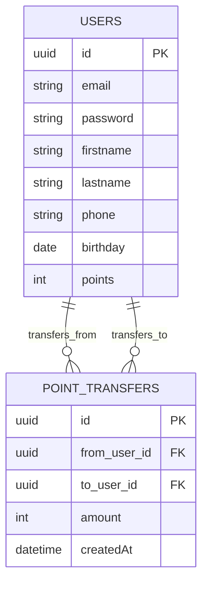

# Database ER Diagram (Mermaid)

This file contains an ER diagram (Mermaid format) generated from the TypeORM entities in this project (`User`, `Transfer`).

Render with Mermaid (e.g., VS Code Mermaid preview or mermaid.live).

Notes
- `USERS` corresponds to the `users` table from `src/users/user.entity.ts`.
- `POINT_TRANSFERS` corresponds to the `point_transfers` table from `src/transfer/transfer.entity.ts`.
- The `from_user_id` and `to_user_id` columns are foreign keys referencing `USERS.id`.
- Use this diagram as a quick reference for database relationships. For production use, generate canonical schema from migrations or the database itself.
